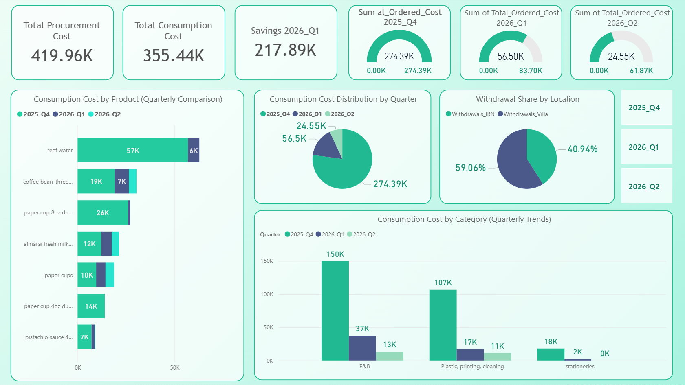

# 📊 Operational Cost & Consumption Analysis — Masarat Real Estate

> A business-focused Power BI dashboard analyzing operational expenses, resource consumption efficiency, and cost optimization across three quarterly periods.

---

## 📌 Project Overview

This project presents an analytical dashboard exploring and comparing operational spending patterns within a real estate company (Masarat, Dubai).

The analysis covers **2025 Q4, 2026 Q1, and 2026 Q2**, structured as an **exploratory business report** aimed at extracting actionable insights — with a focus on evaluating the impact of a new operations manager who took over procurement and cost control starting in 2026.

Note on Data Privacy:
"The company name and specific identifying details in this project have been anonymized to protect proprietary operational data, while fully preserving the underlying analytical logic and business insights."

---

## 📊 Key Insights

* A **significant cost spike** was observed in **2025 Q4**, indicating inefficient resource management under the previous administration
* A **clear cost reduction** was achieved in 2026 Q1 and Q2 following the management change
* Several items showed a **0% withdrawal ratio** → inactive stock (over-purchasing risk)
* Several items showed a **100% withdrawal ratio** → fully consumed (stock-out risk)
* High-cost items were identified as major contributors to total expenses

---

## 📈 Dashboard Pages

### 1. All Quarters

A cross-quarter overview of operational costs and consumption behavior. Compares total spending, cost by category, and the gap between ordered vs. consumed stock across all three periods. The cost savings measure directly quantifies the financial impact of the management transition from Q4 2025 to Q1 2026.

---

### 2. Outliers & Stock Performance

A product-level performance page designed to support future procurement decisions. It surfaces two critical lists: **inactive stock items** (0% consumption — wasted budget) and **high-consumption items** (100% consumption — disruption risk), alongside cost outliers. This page gives management a direct tool for optimizing order quantities in upcoming quarters.

---

## 🧠 Analytical Approach

### Data Preparation

Three quarterly Excel reports were cleaned independently in Power Query, then merged into a single unified table (`All Periods`).

**Key cleaning operations:**

* Removed index columns and summary rows from each source table
* Enforced consistent data types across numeric and text fields
* Standardized product names (trim, lowercase) and unit labels (trim, uppercase)
* Corrected category misclassifications for specific items
* Added a `Period` tag to each table to preserve quarterly context after merging
* Resolved column name conflicts and structural inconsistencies between quarters
* Replaced nulls with 0 in order quantity and withdrawal columns
* Consolidated duplicate and mismatched columns using conditional logic
* Renamed all columns to clean, standardized English names

### Feature Engineering

**Calculated Columns:**
`Available Quantity = Opening Stock + Quarterly Order Qty`
`Total Withdrawals = Withdrawals IBN + Withdrawals Villa`
`Withdrawal Ratio = Total Withdrawals / Available Quantity`

**DAX Measures:**
`Total Cost of Consumed Stock` · `Total Cost of Ordered Stock` · `Savings 2026 Q1 vs 2025 Q4`

---

## 🛠 Tools & Technologies

| Tool | Purpose |
|---|---|
| Power BI | Data visualization & dashboard design |
| Power Query | Data cleaning & transformation |
| DAX | Measures and calculated logic |

---

## 📂 Deliverables

* Power BI Dashboard (`.pbix`)
* PDF Report (Dashboard Preview)
* Project Documentation (README)

---

## ⚠️ Notes

* Based on real business data
* Exploratory analysis focused on insight generation, not direct decision implementation

---

## 👤 Author

**Salman Al-Jabai**
Data Analyst | MIS Student

---

*Turning operational data into actionable business insights.*

